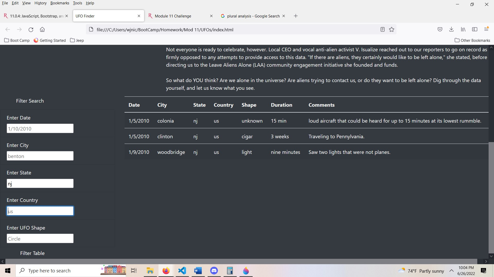

# UFOs

## Intensions
The main concept behind this project was to use create an interactive website which uses Bootstrap to customize and create a table from a JavaScript array. The website’s function is to receive user input and filter UFO sighting data.  

## Website Walk Through  
The functionality of this website is simple and straight forward. There is one main page that a user will input information into. The website will filter data based on the user input. The web script filters a JavaScript based set of data and returns specific parameters. Each input has a shaded example of a working input. 

In the example image we can see the general functions. Each filter search criteria on the left of the screen will take user input and filter through the JavaScript array accordingly. The filter table button will perform the action of filtering. As seen in the photo, the input to State was nj and the data filtered all data that was linked to NJ UFO sightings.

## Conclusion
The analysis went well and the website is functioning as intended. The current amount of data is very underwhelming, but that drawback is minor. The current script will easily accept other data sets and can be altered to perform similar analyses. I believe the shape input is a little difficult to conceptualize. I would recommend adding a key to give the user and idea of possible inputs. You could also add an element of data scrapping into the code to keep the data current and relevant. 
